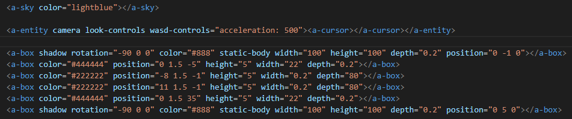

# Project WEBXR : [MATH +-X/]
## Project Explanation
this project is made for the individual final project assigment of RVA class that is to make application web XR that's have a purpose for education or games, and etc. 

## Application Function
This Application is design to help an elementary school in understanding Math subjec that is the basic math operation such as addition, subtraction, multiplication, and division.

## World Explanation
this app have a world that only consist a single room that have a size at least 15x40 written in program, inside of this room there are 4 symbol of Math operation and there are many blackboard each have a specific subjet written in it such greeting board, and learning board( each board teach one part of the operation), board for quiz and the answer that will show by clicking the triangle button in hte room.

## Program Explanation

### Ceiling, Room
 

this part is used to make the wall and the ceiling in the room, it doesn't have a physics so user can penetrate the wall if choose so.

### Math Symbol

this part is to show the symbol of the basic math operation, all of the symbol(except the division one) is imported from the sketchfab.com, and the division one is made from vectary website

this is for the learning board there will be four learning board and one board for greeting in the room each is for specific subject in basic math operation, all of the board is made ini blender and the word is made in the 3d paint in windows t self

this is the board that is able to move downward or upward if the choose either the upward triangle or the downward triangle each will move the board in designated position, there are three type of this board, the firts one is the board that filled with the question for the user, second one are two board that have correct or wrong word depending on which the answer (that is in the triangle for each boar) the player choose and last that is the third is a board that have clue that will help solving the question.    

